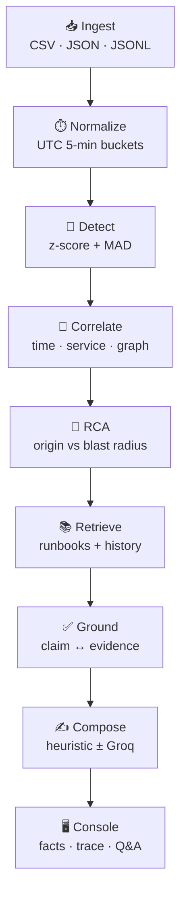

<p align="center">
  
</p>

<h1 align="center">Grounded Incident Analysis</h1>

<p align="center">
  <strong>The overnight incident board.</strong><br/>
  Logs and metrics in. A ranked origin, cited RCA, and a report you can defend — out.
</p>

<p align="center">
  
  
  
  
  
</p>

<p align="center">
  Detectors first. LLM last. If the evidence pack cannot support a claim, the product <em>refuses</em>.
</p>

---

## Why this exists

Most “AI incident” demos paste a CSV into a chat box and hope the paragraph is right.

This is the opposite: typed events, eight independent detectors, graph correlation, ranked RCA, retrieved runbooks, grounding, then an optional rewrite. The model does not find the incident. Correlation already did.

| Typical portfolio | This project |
| --- | --- |
| Paste logs into ChatGPT | Typed `LogEvent` / `MetricPoint` rows |
| The model *is* the product | The model is optional last-mile rewrite |
| One fluent paragraph | Facts stay put when prose changes |
| Chatbot that invents a cause | Q&A that cites the pack or refuses |
| Hidden token cost | Model-trace chips an interviewer can read |

---

## Pipeline



**LLM sits at compose, not at detect.** If Groq is down, the heuristic report and the detector ledger still exist.

---

## Features

### Core analysis

| | Feature | What it does |
| --- | --- | --- |
| 📥 | **Ingest** | CSV, JSON, JSONL logs and metrics. Invalid rows are counted, not silently dropped. Optional Prometheus `query_range`. |
| ⏱️ | **Normalize** | Timestamps lock to UTC and fold into five-minute buckets so a latency spike and an error burst can actually meet. |
| 📡 | **Detect** | Independent families: latency, error rate, CPU, memory, traffic, availability, error-log burst, critical-log burst. Z-score + MAD gates in `configs/default.yaml`. |
| 🔗 | **Correlate** | Anomalies group by time, same service, dependency edges, and cross-signal bonuses. Isolated noise stays an anomaly, not an incident. |
| 🎯 | **RCA** | Scores origin vs blast radius on `configs/service_dependencies.yaml`. Downstream pain is not automatically the cause. |
| 📚 | **Retrieve** | Deterministic lexical retrieval over `data/knowledge/runbooks` and historical incidents. Snippets carry citation ids. |
| ✅ | **Ground** | Every claim is checked against detector output and retrieved snippets. Policy can warn or fail. |
| 📦 | **Artifacts** | Every run writes JSON under `artifacts/` — timeline, anomalies, incidents, RCA, reports, run summary. |

### Console (the demo you walk)

| | Feature | What to show |
| --- | --- | --- |
| 🖥️ | **Command center** | One-click scenarios: Checkout cascade, Healthy baseline, Degraded partial. |
| 🔍 | **Model trace** | Provider, model, tokens, latency, cache hits, fallback, grounding, retrieved snippets. |
| ⚖️ | **Dual compose** | Left = immutable detector facts. Right = heuristic or Groq rewrite. Toggle does not re-run detectors. |
| 💬 | **Closed-book Q&A** | `POST /analysis-jobs/{id}/ask` may only see that run’s pack. Weather in Tokyo → refuse. |
| 🧾 | **Report studio** | Summary, facts, handoff, remediations, review states. |
| 🚨 | **Incidents / anomalies** | One correlated candidate from fourteen detector hits on the cascade. |
| 🧪 | **Eval + pipeline pages** | How the stages and quality gates work, in product copy not a wiki. |

### AI last mile (honest)

| | What | What it is not |
| --- | --- | --- |
| 🧠 | Heuristic composer over the evidence JSON | A local LLM |
| ⚡ | Optional **Groq** or OpenAI rewrite | The analysis engine |
| 📊 | Model trace on every job | Hidden API spend |
| 🚫 | Q&A that refuses unsupported questions | ChatGPT on logs |
| 🔐 | `.env` keys never leave the machine | A trained neural net |

Say this in an interview:

> AI systems, not ML research. Schemas, retrieval, grounding, eval, optional LLM. No neural net replacing the detectors.

---

## Stack

```text
┌──────────────────────────────────────────────────────────┐
│  Next.js 16  ·  http://127.0.0.1:3000                    │
│  Overview · Incidents · Reports · Q&A · Interview script │
└──────────────────────────┬───────────────────────────────┘
                           │  /backend  proxy
┌──────────────────────────▼───────────────────────────────┐
│  FastAPI  ·  http://127.0.0.1:8000                       │
│  jobs · ask · review · samples · health · webhook        │
└──────────────────────────┬───────────────────────────────┘
                           │
┌──────────────────────────▼───────────────────────────────┐
│  Python 3.12  ·  src/incident_agent                      │
│  ingest → detect → correlate → RCA → retrieve → ground   │
│  compose (heuristic always, Groq optional)               │
└──────────────────────────────────────────────────────────┘
```

---

## Quick start

**Needs:** Python 3.12+, Node.js 22+

```bash
git clone https://github.com/Instincts11/grounded-incident-analysis.git
cd grounded-incident-analysis

python -m venv .venv
# Windows
.venv\Scripts\activate
# macOS / Linux
# source .venv/bin/activate

pip install -e .

# API
python -m uvicorn incident_agent.api.main:app --reload --host 127.0.0.1 --port 8000

# Console (second terminal)
npm --prefix web install
npm --prefix web run dev
```

Open **http://127.0.0.1:3000/console**

1. Confirm the health pill is `ok`.
2. Run **Checkout cascade**.
3. Read **model trace** → **facts vs rewrite** → ask **CPU vs baseline**, then **Refuse this**.

CLI-only demo (no UI):

```bash
make run-demo
```

Artifacts land under `artifacts/demo/`.

---

## Optional Groq

Compose works with zero keys (heuristic). To rewrite with Groq, copy `.env.example` to `.env`:

```env
INCIDENT_AGENT_LLM_PROVIDER=groq
INCIDENT_AGENT_GROQ_API_KEY=gsk_...
```

Never commit `.env`. Never paste a key into chat or `.env.example`.

Health check:

```http
GET http://127.0.0.1:8000/health
```

```json
{ "status": "ok", "llm_provider": "groq", "report_model": "openai/gpt-oss-20b" }
```

---

## Bundled scenarios

| Scenario | Files | Expected board |
| --- | --- | --- |
| 🔥 **Checkout cascade** | `data/sample/incident/` | One incident, ~14 detector hits, full report |
| 🌿 **Healthy baseline** | `data/sample/healthy/` | Zero incidents — that is success |
| ⚠️ **Degraded partial** | `data/sample/degraded/` | Sparse inputs, warnings, no invented incident |

---

## API surface

| Method | Path | Why it exists |
| --- | --- | --- |
| `GET` | `/health` | Live provider + model |
| `GET` | `/workspace/samples` | One-click datasets |
| `POST` | `/analysis-jobs` | Run the pipeline |
| `GET` | `/analysis-jobs/{id}` | Job + reports + **compose_trace** |
| `POST` | `/analysis-jobs/{id}/ask` | Closed-book Q&A |
| `POST` | `/analysis-jobs/{id}/reports/{incident}/review` | draft → reviewed → approved / rejected |
| `GET` | `/incidents` · `/anomalies` | Latest-job ledgers |

---

## Project layout

```text
src/incident_agent/    Python core — ingest, detect, correlate, RCA, compose, ask
web/                   Next.js 16 console
configs/               Detectors, graph, grounding, security allowlists
data/sample/           Checkout / healthy / degraded
data/knowledge/        Runbooks + historical incidents
artifacts/             Run JSON (gitignored)
tests/                 Unit + integration
```

---

## Quality

```bash
make quality    # ruff format/check, mypy, pytest with coverage gate
```

---

<p align="center">
  <sub>Built by <a href="https://github.com/Instincts11">Instincts11</a> · AI systems, not a trained model</sub>
</p>
